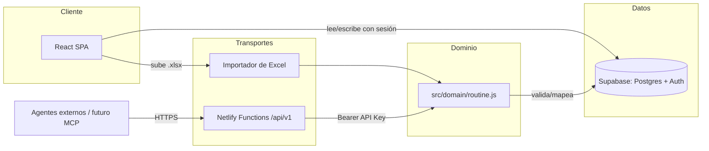

# Gym Tracker

Una app web para seguir tu rutina de gimnasio a partir de una planilla Excel,
con progreso diario, historial de racha, sincronización opcional en la nube,
y una API pública ("**Open Tracker**") para que agentes de IA y otras
integraciones puedan leer y actualizar tu rutina.

> Entendé el proyecto en menos de 5 minutos leyendo este README. Para el
> detalle de arquitectura, decisiones y API, ver [`/docs`](./docs).

## Descripción

Gym Tracker resuelve un problema simple: tenés tu rutina en un Excel y
querés algo mejor que el papel (o la propia planilla) para marcar qué
ejercicio ya hiciste hoy, ver tu progreso del día y no perder el archivo
entre sesiones. Subís el `.xlsx` una vez, la app lo parsea y de ahí en
adelante es una checklist diaria con seguimiento de racha.

Es, además, la base de una plataforma más amplia: **Open Tracker**, una API
REST versionada y autenticada por API Key pensada para que no solo el
frontend, sino también agentes de IA (Claude, ChatGPT, Gemini, etc.), un
futuro servidor MCP, SDKs o apps móviles, puedan leer y escribir la rutina
de un usuario.

## Objetivo

1. **Corto plazo:** que el frontend siga siendo simple, rápido y usable sin
   login (modo invitado, todo en `localStorage`).
2. **Mediano plazo:** que quien quiera sincronizar entre dispositivos pueda
   loguearse con Google y tener su rutina/progreso/historial en la nube.
3. **Largo plazo (Open Tracker):** que la rutina de un usuario sea accesible
   y editable por cualquier integración externa autorizada — empezando por
   un futuro servidor MCP (`gym-tracker-mcp`) que consuma esta misma API sin
   duplicar ninguna lógica de negocio.

## Características principales

- **Importación desde Excel:** una hoja por día, detección tolerante de
  columnas (`Bloque`, `Ejercicio`, `Series`, `Reps/Tiempo`, `Descripción`).
- **Checklist diaria con progreso visual** y reseteo automático al cambiar
  de día (incluso si la pestaña queda abierta pasada la medianoche).
- **Historial de racha:** cada día completado al 100% queda registrado.
- **Dos vistas:** Lista (todos los ejercicios del día) y Foco (un ejercicio
  a la vez, con navegación).
- **Login opcional con Google** (Supabase Auth) para sincronizar rutina,
  progreso e historial entre dispositivos — sin login, todo sigue
  funcionando igual en modo invitado con `localStorage`.
- **Menú lateral** (estilo drawer de Material) con la configuración de la
  rutina: cambiar de archivo, cuenta, y acceso a Open Tracker.
- **Open Tracker:** API REST pública v1 (`GET`/`PUT /api/v1/routine`)
  autenticada por API Key, con rate limiting, pensada como contrato estable
  para integraciones externas.

## Stack tecnológico

| Capa               | Tecnología |
|---------------------|------------|
| Frontend             | React 19 + Vite 8 |
| Estilos              | CSS plano (variables CSS, sin framework) |
| Iconos               | [lucide-react](https://lucide.dev/) |
| Parseo de Excel      | [SheetJS (`xlsx`)](https://sheetjs.com/), cargado de forma diferida |
| Backend / API        | Netlify Functions v2 (Deno/Node, formato `Request`/`Response` web-estándar) |
| Base de datos + Auth | [Supabase](https://supabase.com/) (Postgres + Row Level Security + Auth con Google OAuth) |
| Lint                 | [oxlint](https://oxc.rs/) |
| Hosting / Deploy     | Netlify (sitio estático + Functions), deploy manual vía Netlify CLI |

No hay backend propio "tradicional": toda la lógica server-side vive en
Netlify Functions, y toda la persistencia vive en Supabase.

## Arquitectura general



La regla central: **la lógica de negocio (qué es una rutina válida, cómo se
guarda) vive en `src/domain/routine.js`**, y tanto el importador de Excel
como la API la reusan. El detalle completo está en
[`docs/architecture.md`](./docs/architecture.md).

## Estructura del proyecto

```
gym-tracker/
├── docs/                    # Documentación técnica (este directorio)
├── netlify/
│   └── functions/
│       ├── _lib/            # Helpers server-side: auth, rate limit, http, admin client
│       └── routine.js       # GET/PUT /api/v1/routine
├── public/
│   └── favicon.svg
├── src/
│   ├── components/          # Componentes React (UI pura, sin lógica de negocio)
│   ├── domain/
│   │   └── routine.js       # Dominio compartido: validar/normalizar/mapear una rutina
│   ├── hooks/                # useAuth, useWorkoutData, useProgress
│   ├── lib/
│   │   └── supabaseClient.js # Cliente Supabase del navegador (anon/publishable key)
│   ├── utils/                # excelParser, cloudSync, storage, apiKeys, blockColors
│   ├── App.jsx / App.css
│   └── main.jsx
├── index.html
├── netlify.toml              # Config de Netlify (directorio de Functions)
├── package.json
├── SETUP_SUPABASE.md          # Guía de setup manual: Supabase + Google OAuth
├── SETUP_OPEN_TRACKER.md       # Guía de setup manual: tablas de Open Tracker + service role key
└── vite.config.js
```

## Cómo levantar el proyecto localmente

```bash
npm install
```

**Si solo vas a trabajar en el frontend** (sin tocar la API de Open Tracker):

```bash
npm run dev
# http://localhost:5173
```

**Si necesitás probar la API (`/api/v1/routine`)**, hace falta emular las
Netlify Functions, así que se usa el CLI de Netlify en vez de Vite directo:

```bash
npx netlify-cli dev
# http://localhost:8888  (proxea Vite + sirve las Functions)
```

Nota: si usás login con Google en `localhost:8888`, esa URL tiene que estar
agregada en Supabase → Authentication → URL Configuration → Redirect URLs
(por defecto solo está agregada `http://localhost:5173/**`).

## Variables de entorno

| Variable | Dónde se usa | Prefijo `VITE_` | Descripción |
|---|---|---|---|
| `VITE_SUPABASE_URL` | Frontend + Functions | Sí | Project URL de Supabase. |
| `VITE_SUPABASE_ANON_KEY` | Frontend | Sí | `publishable key` de Supabase (segura para el navegador, protegida por RLS). |
| `SUPABASE_SERVICE_ROLE_KEY` | Solo Netlify Functions | **No** | Service role / secret key de Supabase. Nunca debe tener prefijo `VITE_` — si lo tuviera, Vite la incluiría en el bundle del navegador. |

En local, `VITE_SUPABASE_URL` y `VITE_SUPABASE_ANON_KEY` van en un
`.env.local` (ignorado por git). `SUPABASE_SERVICE_ROLE_KEY` **no** va en
`.env.local`: se setea solo como variable de entorno de Netlify
(`netlify env:set SUPABASE_SERVICE_ROLE_KEY ...`), y `netlify dev` la
inyecta automáticamente en local porque el sitio ya está linkeado.

El setup completo de Supabase (tablas, RLS, Google OAuth) está en
[`SETUP_SUPABASE.md`](./SETUP_SUPABASE.md) y
[`SETUP_OPEN_TRACKER.md`](./SETUP_OPEN_TRACKER.md).

## Scripts disponibles

| Script | Qué hace |
|---|---|
| `npm run dev` | Levanta Vite en modo desarrollo (solo frontend, sin Functions). |
| `npm run build` | Build de producción a `dist/`. |
| `npm run lint` | Corre `oxlint` sobre el proyecto. |
| `npm run preview` | Sirve el build de `dist/` localmente. |

No hay script de test todavía (ver [Roadmap](./docs/roadmap.md) / deuda
técnica en [`docs/handoff.md`](./docs/handoff.md)).

## Cómo desplegarlo

El sitio (`gym-tracker-425` en Netlify, dominio `gym-tracker.carlossperanza.fyi`)
**no** está conectado a Git para CI/CD — los deploys son manuales vía CLI:

```bash
npm run build
netlify deploy --prod --dir=dist
```

Esto sube tanto el sitio estático como las Netlify Functions
(`netlify/functions/`). Antes del primer deploy con Open Tracker hace falta
haber seteado `SUPABASE_SERVICE_ROLE_KEY` con `netlify env:set` (ver
[Variables de entorno](#variables-de-entorno)).

## Roadmap de alto nivel

MVP (Excel + checklist) → Login y sync con Supabase → Menú lateral →
**Open Tracker** (API pública v1) → Servidor MCP (`gym-tracker-mcp`) →
más herramientas/endpoints → analytics/historial avanzado → SDKs → mobile.

Detalle completo, con estado de cada etapa, en
[`docs/roadmap.md`](./docs/roadmap.md).

## Cómo contribuir

Este repo está pensado para ser mantenido tanto por desarrolladores humanos
como por distintos modelos de IA. Antes de tocar código:

- Leé [`docs/architecture.md`](./docs/architecture.md) para entender las
  capas y sus responsabilidades.
- Leé [`docs/decisions.md`](./docs/decisions.md) para no repetir preguntas
  ya resueltas (y sus alternativas descartadas).
- Si sos (o te está usando) un asistente de IA, empezá por
  [`docs/handoff.md`](./docs/handoff.md) y seguí las reglas de
  [`docs/CONTRIBUTING_AI.md`](./docs/CONTRIBUTING_AI.md) — en particular:
  la lógica de negocio vive en `src/domain/`, nunca en el transporte
  (REST, Excel, futuro MCP), y todo cambio grande se propone con
  alternativas y trade-offs antes de implementarse.

## Licencia

Todavía no se eligió una licencia (placeholder). Hasta que se defina, el
código no tiene una licencia open source explícita. Si el objetivo es
distribuirlo como proyecto abierto, MIT es la opción más simple y permisiva
para este tipo de proyecto — pendiente de decisión.
