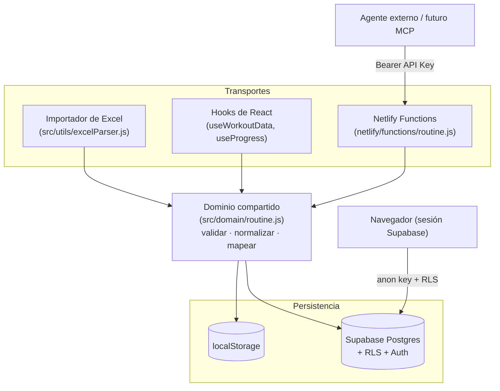
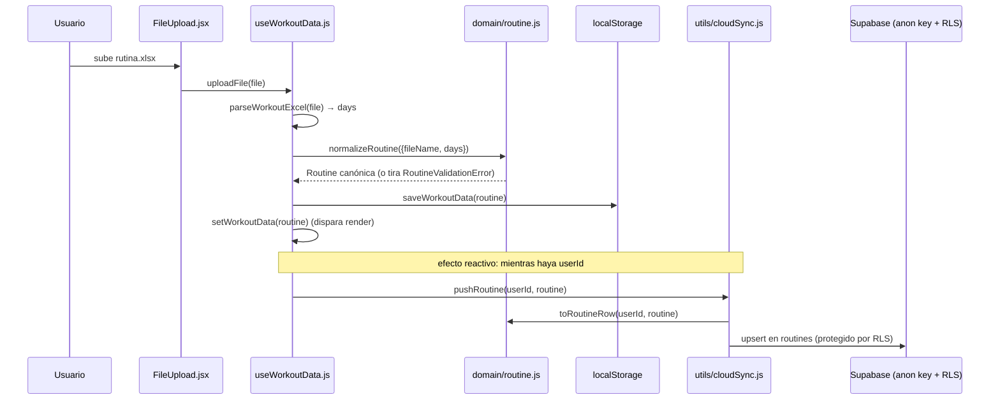
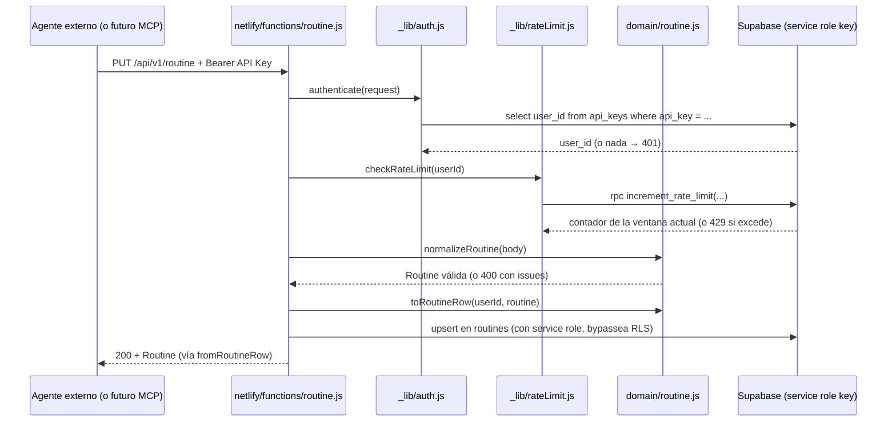
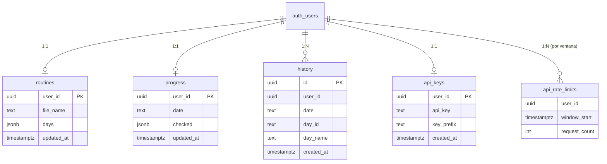

# Arquitectura

> Ver también: [`README.md`](../README.md) · [`decisions.md`](./decisions.md) · [`api.md`](./api.md) · [`handoff.md`](./handoff.md)

Este documento describe el **sistema**, no el árbol de archivos. Para la
estructura de carpetas ver el README; acá interesa qué hace cada capa, por
qué está separada así, y cómo fluyen los datos.

## Vista general

Gym Tracker tiene tres "transportes" que entran o salen de una única capa
de dominio, y dos formas de llegar a la persistencia (Supabase):

La idea central, repetida en todo el proyecto: **ningún transporte
(Excel, REST, futuro MCP) contiene lógica de negocio.** Todos llaman a las
mismas funciones puras de `src/domain/routine.js`.

## Capas y responsabilidades

| Capa | Ubicación | Responsabilidad | NO responsabilidad |
|---|---|---|---|
| **UI (componentes)** | `src/components/` | Renderizar, capturar interacción del usuario, estilos. | No accede a Supabase ni valida datos de negocio. |
| **Hooks** | `src/hooks/` | Estado de React, orquestar cuándo leer/guardar (local y nube), ciclo de vida. | No definen qué es una "rutina válida" — delegan al dominio. |
| **Dominio** | `src/domain/` | Reglas de negocio puras: validar, normalizar, mapear DTO ↔ fila de DB. Sin efectos secundarios, sin I/O. | No sabe nada de HTTP, React, Excel ni Supabase. |
| **Utils (transporte/infra)** | `src/utils/` | Adaptadores: parsear Excel, sincronizar con Supabase desde el navegador, `localStorage`, generar API Keys. | No implementan reglas de negocio propias — llaman al dominio. |
| **Netlify Functions** | `netlify/functions/` | Transporte HTTP: parsear el request, autenticar, rate-limit, formatear la respuesta. | No contienen reglas de "qué es válido" — llaman al dominio. |
| **Supabase** | externo | Persistencia (Postgres), autenticación (Google OAuth), autorización de bajo nivel (RLS). | No contiene lógica de aplicación (solo constraints/RLS). |

## Qué pertenece al dominio y qué no

**Pertenece a `src/domain/routine.js`:**
- La forma canónica de una rutina (`Routine`, `Day`, `Exercise`).
- Qué hace que una rutina sea válida (`assertValidRoutine`).
- Cómo se normaliza un input externo (`normalizeRoutine`).
- El mapeo entre el DTO público y la fila de la tabla `routines`
  (`toRoutineRow` / `fromRoutineRow`).

**NO pertenece al dominio** (y por eso vive en otro lado):
- Parsear un archivo `.xlsx` concreto → es un detalle de transporte
  (`src/utils/excelParser.js`), específico de "cómo entra el dato", no de
  "qué es un dato válido".
- Autenticar un request HTTP, leer el header `Authorization`, aplicar
  rate limiting → son preocupaciones de transporte (`netlify/functions/_lib/`).
- Cómo se guarda en `localStorage` vs. cómo se sincroniza con Supabase
  desde el navegador → es infraestructura de persistencia del lado
  cliente (`src/utils/storage.js`, `src/utils/cloudSync.js`), no reglas de
  negocio.
- Generar y almacenar una API Key → es un dato de cuenta
  (`src/utils/apiKeys.js`), no parte del contrato público de la rutina.

## Flujo de datos: importar un Excel (con sesión iniciada)

## Flujo de datos: Open Tracker (agente externo)

Notar que **ambos flujos convergen en `src/domain/routine.js`** para
validar y mapear — es la prueba de que no hay lógica duplicada entre el
importador de Excel y la API.

## Cómo interactúan frontend, servicios y Supabase

Hay **dos caminos de acceso a Supabase**, deliberadamente distintos:

1. **Frontend → Supabase directo** (`src/lib/supabaseClient.js`, `anon`/
   `publishable` key): usado por `cloudSync.js` y `apiKeys.js`. La
   autorización la hace Postgres Row Level Security (`auth.uid() =
   user_id` en cada tabla) — el frontend nunca decide a mano qué puede leer
   un usuario, RLS lo garantiza.
2. **Netlify Functions → Supabase con service role key**
   (`netlify/functions/_lib/supabaseAdmin.js`): bypasea RLS a propósito,
   porque un request autenticado por API Key no tiene una sesión de
   Supabase (no hay JWT de usuario). La autorización la hace el código de
   la Function, resolviendo `user_id` a partir de la API Key y filtrando
   manualmente. La service role key **nunca** se expone al navegador
   (variable de entorno sin prefijo `VITE_`).

El frontend **no** pasa (todavía) por `/api/v1/routine` — sigue hablando
directo con Supabase. Es una decisión explícita, no un olvido: ver
[`decisions.md`](./decisions.md#9-el-frontend-no-migra-a-consumir-su-propia-api-todavía).

## Esquema de datos (Supabase / Postgres)

Todas las tablas tienen RLS habilitado con policy `auth.uid() = user_id`
(excepto `api_rate_limits`, que solo la toca la service role key desde las
Functions). El SQL completo está en [`SETUP_SUPABASE.md`](../SETUP_SUPABASE.md)
y [`SETUP_OPEN_TRACKER.md`](../SETUP_OPEN_TRACKER.md).

## Decisiones de diseño (resumen)

El detalle completo, con alternativas y trade-offs, está en
[`decisions.md`](./decisions.md). Resumen:

- **Netlify Functions**, no un servidor separado — cero infraestructura
  nueva, mismo dominio y flujo de deploy.
- **Service role key + autorización manual**, no JWTs minteados por
  request — más simple para un backend propio.
- **API Key en texto plano, protegida por RLS**, no hash-only — porque
  todavía no hay "regenerar", y hash-only sin eso deja al usuario sin forma
  de recuperar su key.
- **Rate limiting en Postgres** (upsert atómico por ventana de 1 minuto),
  no en memoria ni con un servicio externo — reusa infraestructura ya
  existente, portable y testeable con `netlify dev` + `curl`.
- **El frontend no migra a la API todavía** — sigue hablando directo con
  Supabase; migrar es un paso futuro, no parte de esta iteración.

## Inconsistencias conocidas entre documentación y código

- El código de Open Tracker (`src/domain/`, `netlify/functions/`,
  `src/components/OpenTracker.jsx`, `src/utils/apiKeys.js`, y los cambios
  relacionados en `useWorkoutData.js`/`cloudSync.js`/`SideMenu.jsx`) está
  **implementado y desplegado en producción**, pero **todavía no está
  commiteado a git** al momento de escribir este documento — el último
  commit (`ea5383a`) es anterior a Open Tracker. Ver
  [`handoff.md`](./handoff.md) para el estado exacto.
- No hay tests automatizados en el proyecto (ni unitarios ni de
  integración) — toda la verificación hasta ahora fue manual (`npm run
  lint`, `npm run build`, pruebas con `curl` contra `netlify dev` y contra
  producción).
