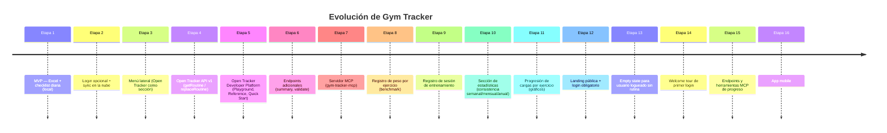

# Roadmap

> Ver también: [`README.md`](../README.md) · [`handoff.md`](./handoff.md) · [`decisions.md`](./decisions.md)

Esto representa la **visión** del proyecto, no un compromiso cerrado. El
orden y el alcance de cada etapa pueden ajustarse; lo que no debería
cambiar es la dirección general: de una app personal a una plataforma
abierta ("Open Tracker") consumible por múltiples clientes.

## Etapa 1 — MVP: Excel + checklist diaria ✅

Subir un `.xlsx`, parsearlo, marcar ejercicios como hechos, resetear por
día. Todo en `localStorage`, sin cuenta ni backend.

## Etapa 2 — Login opcional + sync en la nube ✅

Google OAuth vía Supabase Auth. Rutina, progreso e historial sincronizados
entre dispositivos cuando hay sesión — sin romper el modo invitado.

## Etapa 3 — Menú lateral ✅

Se saca la configuración de la rutina (cambiar archivo, cuenta) del header
a un drawer estilo Material, dejando lugar para secciones nuevas (como
Open Tracker) sin rediseñar cada vez.

## Etapa 4 — Open Tracker: API pública v1 ✅

`GET`/`PUT /api/v1/routine`, autenticada por API Key, con rate limiting y
dominio compartido con el importador de Excel. Ver [`api.md`](./api.md).

## Etapa 5 — Open Tracker: Developer Platform ✅

Open Tracker pasa de ser una pantalla de credenciales a un developer hub
(estilo Stripe/Supabase/Vercel/Resend): Credentials (Base URL + API Key
con copiar) y Developer Resources (Playground, Reference, Quick Start,
y la guía "Conectar MCP" agregada en la Etapa 7).
El **Playground** es interactivo de verdad — corre sobre un spec de
OpenAPI generado desde los mismos schemas de Zod que valida la API
(nunca un spec mantenido a mano), renderizado con Scalar y
pre-autenticado con la API Key real del usuario. Ver
[`api.md`](./api.md#documentación-interactiva) y `decisions.md` #11/#12.

## Etapa 6 — Endpoints adicionales de la API 🔜

- `GET /api/v1/routine/summary` — resumen de la rutina (cantidad de días,
  ejercicios, bloques). Requiere escribir la función de resumen en
  `src/domain/routine.js` (no existe todavía).
- `POST /api/v1/routine/validate` — validar un payload sin guardarlo.
  Bajo esfuerzo: envolver `assertValidRoutine` (ya existe) en una Function.
- Regeneración de API Key (y, con eso, revisar la decisión de guardarla en
  texto plano — ver `decisions.md` #7).

## Etapa 7 — Servidor MCP (`gym-tracker-mcp`) ✅

Repositorio separado. Es un **adaptador delgado**: traduce herramientas
MCP a llamadas HTTP contra esta API, sin lógica de negocio propia ni
acceso directo a la base de datos. Implementado, desplegado (local stdio
+ remoto vía Netlify Function con OAuth 2.1 + DCR y login real de Google,
reusando la Supabase Auth de este mismo proyecto) y con una guía de
conexión ("Conectar MCP") en la sección Open Tracker de esta app.
Herramientas:

- `getRoutine()` → `GET /api/v1/routine` ✅
- `replaceRoutine()` → `PUT /api/v1/routine` ✅
- `getRoutineSummary()` → `GET /api/v1/routine/summary` (pendiente de la Etapa 6)
- `validateRoutine()` → `POST /api/v1/routine/validate` (pendiente de la Etapa 6)

## Etapa 8 — Registro de peso por ejercicio (benchmark) ✅

Agregar un campo de peso (y opcionalmente series/reps hechas) por
ejercicio, capturable tanto en modo lista (`ExerciseCard.jsx`) como en modo
foco (`FocusCard.jsx`), para que el usuario vea qué carga usó la última
vez y tenga un benchmark. Requiere extender el modelo de dominio
(`src/domain/routine.js`) — hoy `ExerciseSchema` no tiene ningún campo
numérico, solo texto descriptivo (`series`, `repsTime` son strings libres
del Excel, no datos capturados por el usuario).

## Etapa 9 — Registro de sesión de entrenamiento ✅

Al llegar al final de la rutina en modo foco (pantalla "¡Día completado!"
en `FocusView.jsx`) — y considerar si también en modo lista al llegar al
100% en `ProgressBar.jsx` — ofrecer la opción explícita de "registrar la
sesión": guardar una foto del día (ejercicios hechos, pesos de la Etapa 8,
fecha) en una tabla nueva (ej. `training_sessions`), distinta de `history`
(que hoy es solo un marcador de racha vía `date/day_id/day_name`, sin
detalle real de qué se entrenó).

## Etapa 10 — Sección de estadísticas ✅

Pantalla nueva (un `screen` adicional en `App.jsx`, como ya existe
`'open-tracker'`) para ver consistencia semanal/mensual/anual (días
completados vs. planificados) y qué ejercicios se entrenan con más
frecuencia. Depende por completo de la Etapa 9: sin sesiones registradas
no hay de dónde sacar estos números.

## Etapa 11 — Progresión de cargas por ejercicio 💭

Dentro de la sección de estadísticas (Etapa 10), gráfico de evolución del
peso usado en un ejercicio a lo largo del tiempo. Se separa de la Etapa 10
porque suma una dependencia nueva al frontend (no hay ninguna librería de
gráficos en el proyecto todavía) y es más esfuerzo que un resumen numérico.

## Etapa 12 — Landing pública + login obligatorio 💭

Cambio de comportamiento importante: hoy la app funciona completa en modo
invitado (ver Etapa 2 — "sin romper el modo invitado"), todo en
`localStorage`, sin cuenta. Esta etapa lo revierte: sin sesión, en vez de
la app, se muestra una landing explicando qué es Gym Tracker (una app de
bienestar "AI-friendly") y sus beneficios, con el login como único camino
para entrar. Vale la pena registrar esto como una ADR nueva en
`decisions.md` antes de tocar código, porque contradice una decisión ya
tomada y documentada en la Etapa 2.

## Etapa 13 — Empty state para usuario logueado sin rutina 💭

Hoy, sin `workoutData`, cualquier usuario (invitado o logueado) ve la
misma pantalla (`FileUpload.jsx`) con un dropzone de Excel. Con el login
ya obligatorio (Etapa 12), sumar dos caminos más al dropzone: descargar
una plantilla `.xlsx` lista para llenar, o ir directo a la guía "Conectar
MCP" (ya existe en `ConnectMcp.jsx`) para completarla por chat con un
asistente de IA en vez de a mano.

## Etapa 14 — Welcome tour de primer login 💭

Recorrido guiado (tooltips/spotlight sobre el empty state de la Etapa 13)
que se muestra una sola vez, la primera vez que un usuario nuevo inicia
sesión. Depende de la Etapa 13 porque recorre justamente esas opciones
nuevas.

## Etapa 15 — Endpoints y herramientas MCP de progreso 💭

Nuevos endpoints en la API pública (ej. `GET /api/v1/progress/summary`) y
las herramientas MCP correspondientes en
`gym-tracker-mcp/src/mcp/server.ts` (hoy solo tiene `getRoutine` /
`replaceRoutine`) para que un asistente de IA conectado pueda responder
algo como "¿cómo vengo con mi rutina?" con datos reales. Depende de las
Etapas 9 a 11: sin sesiones ni estadísticas guardadas del lado de
gym-tracker, no hay nada que exponer.

## Etapa 16 — App mobile 💭

No definido si sería una app nativa, una PWA instalable, o un wrapper tipo
Capacitor/Expo sobre el mismo frontend. En cualquier caso, consumiría la
misma API pública — no una integración especial.

---

**Leyenda:** ✅ hecho · 🔜 planeado, con diseño claro · 💭 visión, sin
diseño concreto todavía.
