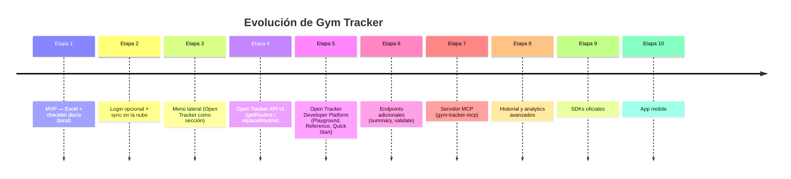

# Roadmap

> Ver también: [`README.md`](../README.md) · [`handoff.md`](./handoff.md) · [`decisions.md`](./decisions.md)

Esto representa la **visión** del proyecto, no un compromiso cerrado. El
orden y el alcance de cada etapa pueden ajustarse; lo que no debería
cambiar es la dirección general: de una app personal a una plataforma
abierta ("Open Tracker") consumible por múltiples clientes.

## Etapa 1 — MVP: Excel + checklist diaria ✅

Subir un `.xlsx`, parsearlo, marcar ejercicios como hechos, resetear por
día. Todo en `localStorage`, sin cuenta ni backend.

## Etapa 2 — Login opcional + sync en la nube ✅

Google OAuth vía Supabase Auth. Rutina, progreso e historial sincronizados
entre dispositivos cuando hay sesión — sin romper el modo invitado.

## Etapa 3 — Menú lateral ✅

Se saca la configuración de la rutina (cambiar archivo, cuenta) del header
a un drawer estilo Material, dejando lugar para secciones nuevas (como
Open Tracker) sin rediseñar cada vez.

## Etapa 4 — Open Tracker: API pública v1 ✅

`GET`/`PUT /api/v1/routine`, autenticada por API Key, con rate limiting y
dominio compartido con el importador de Excel. Ver [`api.md`](./api.md).

## Etapa 5 — Open Tracker: Developer Platform ✅

Open Tracker pasa de ser una pantalla de credenciales a un developer hub
(estilo Stripe/Supabase/Vercel/Resend): Credentials (Base URL + API Key
con copiar) y Developer Resources (Playground, Reference, Quick Start,
y la guía "Conectar MCP" agregada en la Etapa 7).
El **Playground** es interactivo de verdad — corre sobre un spec de
OpenAPI generado desde los mismos schemas de Zod que valida la API
(nunca un spec mantenido a mano), renderizado con Scalar y
pre-autenticado con la API Key real del usuario. Ver
[`api.md`](./api.md#documentación-interactiva) y `decisions.md` #11/#12.

## Etapa 6 — Endpoints adicionales de la API 🔜

- `GET /api/v1/routine/summary` — resumen de la rutina (cantidad de días,
  ejercicios, bloques). Requiere escribir la función de resumen en
  `src/domain/routine.js` (no existe todavía).
- `POST /api/v1/routine/validate` — validar un payload sin guardarlo.
  Bajo esfuerzo: envolver `assertValidRoutine` (ya existe) en una Function.
- Regeneración de API Key (y, con eso, revisar la decisión de guardarla en
  texto plano — ver `decisions.md` #7).

## Etapa 7 — Servidor MCP (`gym-tracker-mcp`) ✅

Repositorio separado. Es un **adaptador delgado**: traduce herramientas
MCP a llamadas HTTP contra esta API, sin lógica de negocio propia ni
acceso directo a la base de datos. Implementado, desplegado (local stdio
+ remoto vía Netlify Function con OAuth 2.1 + DCR y login real de Google,
reusando la Supabase Auth de este mismo proyecto) y con una guía de
conexión ("Conectar MCP") en la sección Open Tracker de esta app.
Herramientas:

- `getRoutine()` → `GET /api/v1/routine` ✅
- `replaceRoutine()` → `PUT /api/v1/routine` ✅
- `getRoutineSummary()` → `GET /api/v1/routine/summary` (pendiente de la Etapa 6)
- `validateRoutine()` → `POST /api/v1/routine/validate` (pendiente de la Etapa 6)

## Etapa 8 — Historial y analytics avanzados 💭

Ideas todavía no comprometidas: tendencias de consistencia a lo largo del
tiempo, progresión de cargas/series por ejercicio, comparación entre
semanas/meses. Depende de cuánto historial estructurado se decida guardar
más allá de la tabla `history` actual (que hoy solo registra días
completados al 100%, no series/pesos por ejercicio).

## Etapa 9 — SDKs oficiales 💭

Wrappers finos sobre `/api/v1` en JS/TS y Python, para que integrar Gym
Tracker desde otro proyecto no requiera reimplementar el cliente HTTP a
mano.

## Etapa 10 — App mobile 💭

No definido si sería una app nativa, una PWA instalable, o un wrapper tipo
Capacitor/Expo sobre el mismo frontend. En cualquier caso, consumiría la
misma API pública — no una integración especial.

---

**Leyenda:** ✅ hecho · 🔜 planeado, con diseño claro · 💭 visión, sin
diseño concreto todavía.
